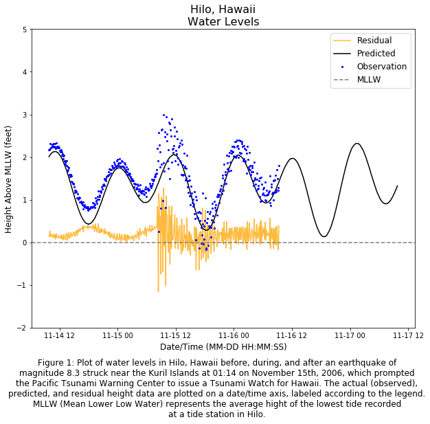

The figure above shows a plot of the measured, predicted, and residual sea level height in
Hilo, Hawaii in mid-November, 2006. Data was collected at NOAA''s National Ocean Service
tide gague near Hilo. The data that was used to create the plot can be found [here](https://www.weather.gov/source/hfo/events/Nov15tsunami/Hilodata.htm)
